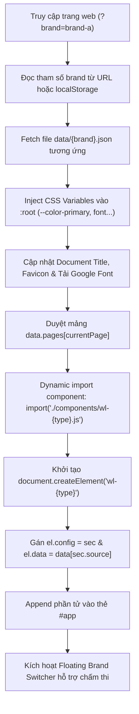

# TÀI LIỆU HƯỚNG DẪN KIẾN TRÚC & PHÂN CHIA DỰ ÁN WEB COMPONENTS
## Chủ đề: Giáo dục và Nghề nghiệp (Tham khảo cấu trúc PrepEdu)

---

## 1. TỔNG QUAN & NGUYÊN TẮC CỐT LÕI

Dự án được xây dựng phục vụ cuộc thi thiết kế web với các yêu cầu đặc thù:
1. **Frontend thuần (Vanilla):** Chỉ sử dụng HTML5 + CSS3 + JavaScript hiện đại (ES Modules, Web Components). **Không dùng framework nặng (React, Vue, Angular)**, không cần bước build (Webpack/Vite), không backend/database.
2. **Kiến trúc Data-driven (Hướng dữ liệu):** Mọi nội dung, hình ảnh, liên kết và màu sắc/font chữ đều được cấu hình trong các file JSON tĩnh (`data/brand-a.json`, `data/brand-b.json`, `data/brand-c.json`).
3. **Một bộ khung — Đa thương hiệu:** Mở cùng một file `index.html`, chỉ cần truyền tham số `?brand=brand-a`, `?brand=brand-b` hoặc `?brand=brand-c` là giao diện lập tức chuyển đổi hoàn toàn sang thương hiệu khác mà không cần sửa code giao diện.
4. **Khả năng mở rộng (Scalability):** Dễ dàng mở rộng từ 1 Landing Page (Vòng loại) thành 3–5 trang hoàn chỉnh (Vòng chung kết) bằng cách tái sử dụng các Web Components có sẵn.

---

## 2. PHÂN BIỆT SECTION VÀ COMPONENT

Trong kiến trúc này:
- **Section (Phần nội dung):** Là một dải nội dung trọn vẹn của trang (Header, Hero, Khóa học, Tính năng, Bước học, Số liệu, FAQ, Liên hệ, Footer...), mỗi section truyền tải một thông điệp và xếp nối tiếp từ trên xuống dưới.
- **Component (Thành phần giao diện):** Là khối code đóng gói sẵn HTML, CSS và JavaScript riêng biệt dưới dạng Web Component tiêu chuẩn (`<wl-*>`). Một section có thể là một component lớn (như `<wl-hero>`), hoặc chứa các component con tái sử dụng (như thẻ `<article class="course-card">` nằm trong `<wl-cards>`).

### Ánh xạ từ thực tế (Mô hình PrepEdu) sang các Web Components của dự án:

| STT | Thành phần giao diện (Tương tự PrepEdu) | Tên Web Component | Chức năng chính |
|:---:|---|---|---|
| **1** | Thanh điều hướng đầu trang | `<wl-header>` | Logo thương hiệu, menu đa cấp (dropdown), nút CTA, ngăn kéo mobile responsive. |
| **2** | Banner mở đầu trang | `<wl-hero>` | Tiêu đề ấn tượng, thông điệp chính, nút đăng ký, thẻ nổi thống kê (`floating-pill`), avatar học viên. |
| **3** | Danh mục chương trình đào tạo | `<wl-cards>` | Lưới khóa học tự co giãn (`repeat(auto-fit)`), badge nổi bật, thời lượng, cấp độ, giá tiền. |
| **4** | Tính năng / Phương pháp đào tạo | `<wl-features>` | Bố cục so le xen kẽ (trái - phải), đánh số 01/02/03, danh sách ưu điểm và hình ảnh minh họa. |
| **5** | Quy trình học tập 3 bước | `<wl-steps>` | Trực quan hóa lộ trình: Đánh giá năng lực → Học tương tác → Nhận việc/thành công. |
| **6** | Bảng số liệu đầu ra | `<wl-stats>` | Thống kê số lượng học viên, tỷ lệ việc làm, mức lương trung bình trên nền màu chủ đạo. |
| **7** | Cảm nhận & Thành tích học viên | `<wl-testimonials>` | Trích dẫn thực tế, hình ảnh đại diện, chức danh và nơi làm việc của cựu học viên. |
| **8** | Khối câu hỏi thường gặp | `<wl-faq>` | Accordion đóng/mở nội dung dạng native `<details>/<summary>`, có hỗ trợ giới hạn `limit`. |
| **9** | Form tư vấn & Đăng ký lộ trình | `<wl-contact>` | Thông tin liên hệ trực quan (Hotline, Email, Địa chỉ) + Form đăng ký có validate client-side. |
| **10**| Chân trang | `<wl-footer>` | Bố cục đa cột: giới thiệu thương hiệu, danh mục khóa học, liên kết nhanh và bản quyền. |
| **11**| Thanh chuyển đổi hành động đáy trang | `<wl-sticky-cta>` | Cố định ở đáy màn hình khi cuộn, nhắc nhở người dùng đăng ký nhận ưu đãi. |

---

## 3. CẤU TRÚC THƯ MỤC DỰ ÁN

```text
demo/
├── index.html                   # Khung trang chính, chứa thẻ #app và nạp core.js
├── requirementr.txt             # Đề bài và quy chuẩn kỹ thuật của cuộc thi
├── infor.md                     # Tài liệu hướng dẫn kiến trúc & phân chia code này
│
├── css/
│   ├── base.css                 # Design Tokens (:root biến màu, font, spacing, reset, utils)
│   └── components.css           # Toàn bộ layout CSS dùng chung & responsive cho các wl-*
│
├── js/
│   ├── core.js                  # Engine trung tâm: Nạp JSON, inject theme, load Google Font, JIT render
│   ├── app.js                   # Logic phụ trợ người dùng (smooth scroll, sự kiện tương tác)
│   └── components/              # Thư mục chứa từng Web Component độc lập
│       ├── wl-header.js
│       ├── wl-hero.js
│       ├── wl-cards.js
│       ├── wl-features.js
│       ├── wl-steps.js
│       ├── wl-stats.js
│       ├── wl-testimonials.js
│       ├── wl-faq.js
│       ├── wl-contact.js
│       ├── wl-footer.js
│       └── wl-sticky-cta.js
│
└── data/                        # Dữ liệu tĩnh của 3 thương hiệu (3 cấu hình)
    ├── brand-a.json             # Cấu hình 1: CodeNest (Lập trình & CNTT)
    ├── brand-b.json             # Cấu hình 2: CareerPath (Hướng nghiệp & Phỏng vấn)
    └── brand-c.json             # Cấu hình 3: SkillWorks (Dạy nghề & Kỹ năng kỹ thuật)
```

---

## 4. PHÂN CHIA CÔNG VIỆC TRONG NHÓM 3 NGƯỜI (TRÁNH XUNG ĐỘT GIT)

| Thành viên | Trách nhiệm chính | Phạm vi tệp tin quản lý | Công việc cụ thể |
|---|---|---|---|
| **Người 1: Thiết kế & CSS** | Visual Design, Tokens & Styling | `css/base.css`<br>`css/components.css` | - Xây dựng bảng màu, typography, khoảng cách, bo góc.<br>- Viết style responsive (Desktop, Tablet, Mobile).<br>- Đảm bảo giao diện tuân thủ nguyên tắc thẩm mỹ cao, không bị lỗi khi đổi font/màu. |
| **Người 2: Khung Code & Logic Engine** | Core Architecture, Routing & Logic | `index.html`<br>`js/core.js`<br>`js/app.js`<br>`wl-header.js`<br>`wl-contact.js`<br>`wl-sticky-cta.js` | - Quản lý quá trình fetch JSON, inject CSS Variables.<br>- Cơ chế JIT dynamic import các component.<br>- Viết widget Brand Switcher để demo.<br>- Xử lý validate form tư vấn, menu dropdown và mobile drawer. |
| **Người 3: Dữ liệu & Thẻ Nội Dung** | Data modeling, Content & Components | `data/brand-a.json`<br>`data/brand-b.json`<br>`data/brand-c.json`<br>`wl-cards.js`<br>`wl-features.js`<br>`wl-steps.js`<br>`wl-stats.js`<br>`wl-testimonials.js`<br>`wl-faq.js`<br>`wl-footer.js` | - Biên tập nội dung tiếng Việt thực tế, mạch lạc cho cả 3 thương hiệu.<br>- Viết các component hiển thị danh sách thẻ, bảng số liệu, accordion FAQ.<br>- Kiểm thử độ bền giao diện: tiêu đề dài/ngắn, thiếu ảnh có bị vỡ khung không. |

---

## 5. QUY CHUẨN TẠO MỘT WEB COMPONENT MỚI (`wl-*`)

Khi cần tạo thêm một Component/Section mới (ví dụ `<wl-partners>` - Đối tác liên kết):

### Bước 1: Tạo file `js/components/wl-<tên>.js`
Mỗi component tuân thủ nghiêm ngặt khung mẫu sau:

```javascript
/**
 * Component: <wl-partners>
 */
class WlPartners extends HTMLElement {
  // Nhận dữ liệu từ JSON được gán bởi core.js
  set data(val) {
    this._data = val;
    this.render();
  }

  get data() {
    return this._data;
  }

  // Nhận tùy chọn hiển thị từ config của section trong JSON
  set config(val) {
    this._config = val;
    this.render();
  }

  get config() {
    return this._config;
  }

  connectedCallback() {
    if (this._data) {
      this.render();
    }
  }

  render() {
    // 1. Kiểm tra an toàn: Dữ liệu rỗng thì không vẽ (tránh vỡ trang)
    if (!this._data || !Array.isArray(this._data)) return;

    const config = this._config || {};
    const title = config.title || 'Đối tác chiến lược';

    // 2. Render HTML dựa trên dữ liệu động
    const logosHtml = this._data.map(item => `
      <div class="partner-item">
        
      </div>
    `).join('');

    this.innerHTML = `
      <section class="section-wrapper">
        <div class="container">
          <h3 class="section-title" style="text-align: center;">${title}</h3>
          <div class="partners-grid">
            ${logosHtml}
          </div>
        </div>
      </section>
    `;
  }
}

// 3. Đăng ký Custom Element với trình duyệt
customElements.define('wl-partners', WlPartners);
export default WlPartners;
```

### Bước 2: Bổ sung CSS trong `css/components.css`
- **Quy tắc vàng:** Chỉ sử dụng biến CSS token đã định nghĩa sẵn (`var(--color-primary)`, `var(--color-border)`, `var(--radius-md)...`). **Không bao giờ viết cứng mã màu `#1D4ED8`** để khi đổi brand, giao diện tự động đổi màu theo.

### Bước 3: Khai báo vào file dữ liệu `data/brand-*.json`
Trong mảng `pages.home`, thêm vị trí hiển thị:
```json
{
  "type": "partners",
  "source": "partners",
  "title": "Doanh nghiệp hợp tác cùng chúng tôi"
}
```
Và thêm mảng dữ liệu `partners` vào gốc JSON:
```json
"partners": [
  { "name": "FPT", "logo": "assets/fpt.png" },
  { "name": "Viettel", "logo": "assets/viettel.png" }
]
```
`core.js` sẽ tự động phát hiện, nạp file `wl-partners.js` và render đúng vị trí đã sắp xếp!

---

## 6. CƠ CHẾ HOẠT ĐỘNG CỦA CORE ENGINE (`js/core.js`)

Quá trình dựng trang diễn ra theo chuỗi hành động khép kín:



---

## 7. BA BẢN CẤU HÌNH THƯƠNG HIỆU MẪU ĐÃ CÀI ĐẶT

| Thuộc tính | Cấu hình 1 (Brand A) | Cấu hình 2 (Brand B) | Cấu hình 3 (Brand C) |
|---|---|---|---|
| **Tên thương hiệu** | **CodeNest** | **CareerPath** | **SkillWorks** |
| **Lĩnh vực** | Lập trình & Công nghệ thông tin | Hướng nghiệp, Sửa CV & Phỏng vấn | Dạy nghề & Kỹ năng kỹ thuật xưởng |
| **Màu chủ đạo** | `#1D4ED8` *(Xanh dương công nghệ)* | `#0F9D8A` *(Ngọc bích Teal tin cậy)* | `#D97706` *(Cam hổ phách thực hành)* |
| **Màu nền trang** | `#FFFFFF` | `#F6FBFA` | `#FFFBF2` |
| **Phông chữ Heading** | `Plus Jakarta Sans` | `Poppins` | `Montserrat` |
| **Chương trình mẫu** | Frontend React, Backend Node, Fullstack, Luyện LeetCode | Tối ưu CV ATS, Mock Interview 1-1, Trắc nghiệm nghề, Deal lương | Đồ họa UI/UX, Điện PLC, Tiện phay CNC, Pha chế Barista |
| **Cam kết đầu ra** | Cam kết việc làm trong 6 tháng | 95% có việc sau 45 ngày | 100% việc làm tại nhà máy/chuỗi |

---

## 8. HƯỚNG DẪN CHẠY DEMO VÀ THUYẾT TRÌNH KHI CHẤM THI

### Cách 1: Chạy bằng lệnh nhanh qua Terminal
```bash
# Sử dụng npx serve (khuyên dùng)
npx serve .

# Hoặc dùng python nếu máy đã cài sẵn
python -m http.server 3000
```
Mở trình duyệt: `http://localhost:3000`.

### Cách 2: Mở bằng VS Code Live Server
Chuột phải vào `index.html` → chọn **Open with Live Server**.

### Trình diễn cho Ban Giám Khảo (11/10):
- **Cách 1:** Sử dụng thanh **"Cấu hình:"** nổi ở góc trái bên dưới màn hình, bấm chọn đổi giữa **Brand A**, **Brand B**, **Brand C**.
- **Cách 2:** Thêm tham số trực tiếp trên thanh địa chỉ URL:
  - `http://localhost:3000/?brand=brand-a` (CodeNest)
  - `http://localhost:3000/?brand=brand-b` (CareerPath)
  - `http://localhost:3000/?brand=brand-c` (SkillWorks)

---

## 9. CÁCH MỞ RỘNG THÀNH 3–5 TRANG (CHO VÒNG CHUNG KẾT)

Khi vào vòng chung kết, để tạo thêm các trang như `contact.html` hay `courses.html`:
1. Tạo file HTML mới (ví dụ `contact.html`):
   ```html
   <!DOCTYPE html>
   <html lang="vi">
   <head>
     <meta charset="UTF-8">
     <title>Liên hệ</title>
     <link rel="stylesheet" href="css/base.css">
     <link rel="stylesheet" href="css/components.css">
   </head>
   <body data-page="contact">
     <div id="app"></div>
     <script type="module" src="js/core.js"></script>
     <script src="js/app.js"></script>
   </body>
   </html>
   ```
2. Trong các file `data/brand-*.json`, chỉ cần thêm cấu hình cho trang `contact` vào đối tượng `pages`:
   ```json
   "pages": {
     "home": [ ... ],
     "contact": [
       { "type": "header" },
       { "type": "contact" },
       { "type": "faq", "limit": 2 },
       { "type": "footer" }
     ]
   }
   ```
Toàn bộ giao diện trang mới sẽ được tự động render mà **không cần viết thêm bất kỳ dòng CSS hay JS nào mới**!
